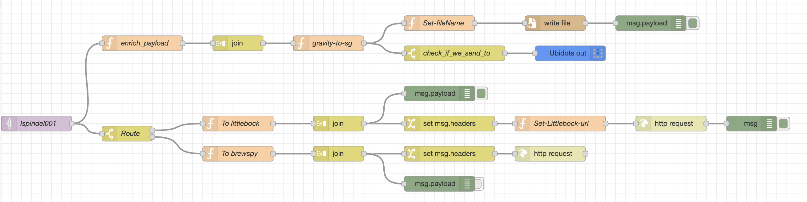

## Node red

Les données collectées par le [ispindle](https://www.ispindel.de/docs/README_en.html) peuvent être envoyées vers un site qui gère vos recettes et/ou brassins 
voir également vers des plateformes qui agrègent des données :

- Brewfather
- Little Bock
- Grainfather
- Ubidots
- Blynk
- Brew Spy

Néanmoins, le iSpindle ne peut être configuré que pour envoyer ses données que sur une seule plateforme et ne peut en occurrence gérer des pertes de données si le site distant ne répond plus.

Ce projet a été développé afin de palier à ces limitations en offrant la possibilité de récolter les données sur un broker MQTT et ensuite de router les données vers différents
destinataires que vous pouvez paramétriser comme par exemple :

 - [Ubidots](https://ubidots.com/)
 - [littlebock](https:www.littlebock.fr)
 - [Brew Spy](https://brew-spy.com/how-to-ispindel.html)
 - [influxdb](https://www.influxdata.com/)
 
**Note**: Les données sont également sauvegardées dans un fichier localement et qui est nommé comme suit: `ispindel_dd-mm-yyyy.txt`



## Comment utiliser l'outil !

Avant de démarrer l' application localement, veillez à :

- Configurer votre iSpindle pour envoyer les données vers le broker MQTT (mosquitto,...),
- Installer les logiciels suivants:
  - [node-red](https://nodered.org/),
  - [mosquitto](http://mosquitto.org/),
  - [influxdb](https://www.influxdata.com/) (optional)
  - [Grafana](https://grafana.com/) (optional)

TODO: Revoir ci-après 

Edit the mosquitto config file (e.g: /usr/local/etc/mosquitto/mosquitto.conf) to append the following 2 parameters
supporting to access the broker without user/pwd and to use non localhost as hostname
```
CONFIG_FILE=/usr/local/etc/mosquitto/mosquitto.conf
cat <<EOF >> $CONFIG_FILE
listener 1883
allow_anonymous true
EOF
```
Open a terminal, start the MQTT broker (e.g: `brew services start mosquitto`)

Next, configure the following ENV vars to specify different parameters as the:

`DEVICE_NAME`: the name of the ispindle as defined using the ispindle `configuration` section. Example: `ispindle001`. This name is used by the IoT ispindle
to publish to different topics the data collected such as `ispindle/<DEVICE_NAME>/#`. 
**NOTE**: This name is also used to set the property of message payload `ubidotsDeviceLabel` to publish the data on `ubidots`

`DEVICE_ID`: ID of the Arduino shipset as defined under the ispindle `information` section. Example: `11223344`

`MQTT_BROKER_IP`: IP address of your pi, laptop where the MQTT broker is running. Example: `192.68.1.80`

`MQTT_BROKER_NAME`: Local name of the MQTT broker as displayed within the `ndoe-red` UI. Example: `mqtt-mac`

`LITTLEBOCK_API`: digits to be passed to the API endpoint `/api/log/ispindle/1111/2222` and used to call the server `www.litlebock.fr`. Example: `1111/22222`

`UBIDOTS_TOKEN`: Ubidots API TOKEN. Example: `BBF-xxxxxxxxxxxx`

`BREW_SPY_TOKEN`: Brew Spy token.

`INFLUXDB_URL`: URL of the influxdb server. Example: `http://localhost:8086`

`INFLUXDB_TOKEN`: [Token](https://docs.influxdata.com/influxdb/cloud/security/tokens/) needed to access influxdb v2.0. Optional

**IMPORTANT**: As it possible that you do not want to send the data to all the recipients supported but the ones you want,
then pass as ENV var the list of the recipients as showed hereafter

```bash
# Some examples. Just set one time the ENV var
export RECIPIENTS="ubidots,littlebock"
export RECIPIENTS="ubidots,littlebock,brewspy"
export RECIPIENTS="littlebock"
export RECIPIENTS=""
```

Define next the others env vars within the terminal
```bash
export DEVICE_NAME="YOUR_ISPINDLE_NAME"
export DEVICE_ID="YOUR_ISPINDLE_ID"
export UBIDOTS_TOKEN="YOUR_UBIDOTS_TOKEN"
export MQTT_BROKER_IP="YOUR_MQTT_IP"
export MQTT_BROKER_NAME="YOUR_MQTT_NAME"
export LITTLEBOCK_API="YOUR_LITTLEBOCK_API"
export INFLUXDB_URL="http://<IP_OR_HOSTNAME>:<PORT>"
```
When done, you can launch node-red using the project available under the folder `./flows`.
```bash
node-red -u ./flows

```

### Liens utiles

- node-red and ubidots: https://help.ubidots.com/en/articles/1440402-connect-node-red-with-ubidots
- Connect `ispindle` to Littlebock, how to calibrate it: https://homebrewing.slammy.net/category/homebrewing/support/
- How to build/debug the Arduino ispindle project: https://dle-dev.com/index.php/2020/10/02/vscode-et-platformio/
- Cloud providers limitation: https://www.mikeandpen.net/beer/ispindel-influx-grafana/
- influxdb, mosquitto, grafana on pi: https://gist.github.com/xoseperez/e23334910fb45b0424b35c422760cb87